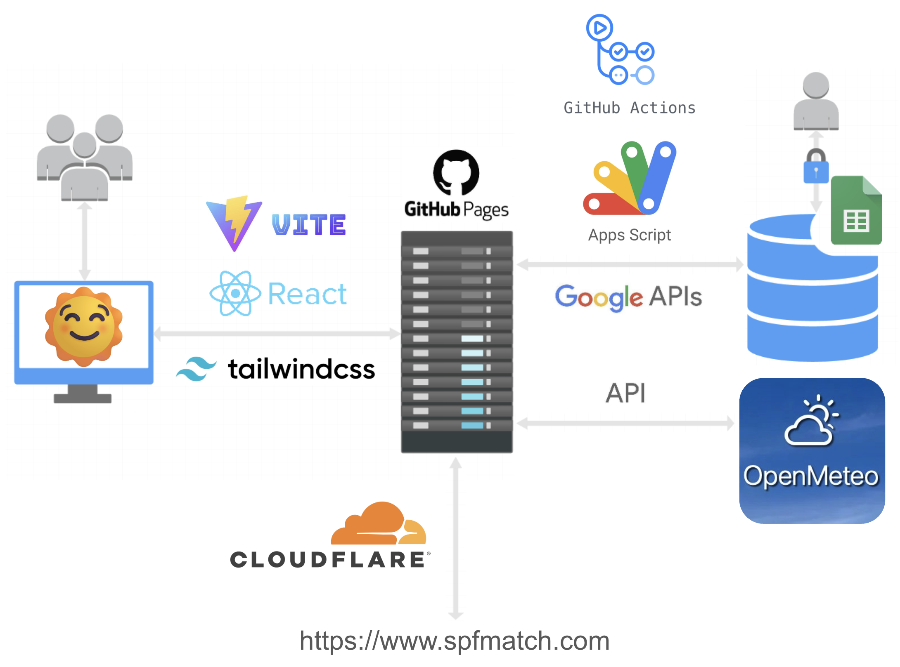

# SPFMatch


In many underserved and minority skin communities, the risk of UV-related damage is high. However, finding sunscreen that truly matches their complexion is difficult as they are not the focus of much research in the field. To address this gap, SPFMatch is an accessible tool focused on helping people of color discover sunscreen products that meet their unique needs.

The application provides personalized sunscreen recommendations by considering skin tone, sensitivity, lifestyle, and user preferences. Instead of relying on trial and error or unclear marketing, users will receive guidance that helps them make informed decisions about their health. Our goal is to make the process simple, intuitive, and empowering so that users feel confident in protecting their skin.

Visit our [project website](https://sites.google.com/view/spfmatch) to learn more about the team behind SPFMatch as well as the development process!

# Access
SPFMatch is accessible at [spfmatch.com](https://spfmatch.com).

For development, clone the repository. Run `npm run dev` in the root folder to start the development server.

# Architecture


## Frontend (React, Vite, Tailwind CSS)

### Structure

The application is organized into several key modules:

**Core Application (`App.tsx`)**
- Single-page application with centralized state management
- Manages navigation between pages (home, quiz, results, resources, reminder)
- Stores quiz answers and calculated Fitzpatrick type
- Passes state and callbacks down through props

**Components (`/src/components/`)**
- `HomePage` - Landing page with application introduction
- `QuizPage` - 11-question assessment for skin type determination
- `ResultsPage` - Displays personalized sunscreen recommendations
- `ResourcesPage` - Educational resources about sun protection
- `ReminderPage` - UV-based reapplication timer with geolocation
- `Navigation` - Shared navigation bar across all pages

**Constants & Configuration (`/src/constants/`)**
- `quiz.ts` - Question definitions and scoring system
- `skinTypes.ts` - Skin type information and characteristics

**Utilities (`/src/utils/`)**
- `fitzpatrick.ts` - Fitzpatrick type calculation logic
- Scoring algorithm maps quiz responses (0-40 points) to types I-VI

**UI Components (`/src/assets/`)**
- Reusable shadcn/ui-style components (button, card, badge, alert)
- Tailwind CSS utility functions

**Types (`/src/types/`)**
- TypeScript interfaces for quiz, sunscreen products, and resources
- Ensures type safety across the application

### Data Flow

1. User takes quiz → `QuizPage` collects answers
2. Answers passed to `fitzpatrick.ts` → calculates Fitzpatrick type
3. Type and skin characteristics → `ResultsPage` filters recommendations
4. Recommendations sourced from `/public/data/sunscreen-database.json` (synced from Google Sheets)

### Programming Languages

- **TypeScript** - Primary language for type-safe React components
- **HTML** - JSX/TSX markup within React components
- **CSS** - Tailwind CSS utility classes for styling

## Backend (Google Apps Script + GitHub Actions)

### Structure

The backend uses a serverless architecture with Google Apps Script for triggers and GitHub Actions for data processing:

**Google Apps Script**
- Manual trigger functions for syncing data from Google Sheets
- Sends `repository_dispatch` events to GitHub Actions workflows
- Functions: `triggerGitHubSync()`, `triggerResourcesSync()`, `triggerFullSync()`

**GitHub Actions Workflows (`/.github/workflows/`)**

**Sync Workflows:**
- `sync-sunscreen-data.yml` - Fetches sunscreen data from Google Sheets
- `sync-resources.yml` - Fetches educational resources from Google Sheets
- Transform scripts (`/.github/scripts/`) convert sheet data to JSON
- Commits transformed data back to repository
- Includes retry logic for handling race conditions

**Deploy Workflow:**
- `deploy.yml` - Builds and deploys to GitHub Pages
- Triggered by: pushes to main, manual dispatch, sync workflow completions
- Builds Vite app and uploads to GitHub Pages

**Data Transformation Scripts (`/.github/scripts/`)**
- `transform-sunscreen-data.cjs` - Parses sunscreen sheet, groups by Fitzpatrick type and skin type
- `transform-resources.cjs` - Parses resources sheet into simple title/link format
- Output: Static JSON files in `/public/data/`

### Data Pipeline

```
Google Sheets → Apps Script → GitHub API (repository_dispatch)
    ↓
GitHub Actions (fetch & transform) → Commit JSON → Push to main
    ↓
Deploy Workflow → Build Vite App → GitHub Pages
```

### Security

- **API keys stored as GitHub Secrets** - Not exposed in frontend code
- **Static JSON generation** - No runtime API calls from browser
- **GitHub PAT** - Secured in Google Apps Script (not committed)
- **Repository dispatch** - Secure trigger mechanism between services

### Programming Languages

- **JavaScript** - Google Apps Script for triggers
- **JavaScript (Node.js)** - GitHub Actions transformation scripts
- **Shell/Bash** - GitHub Actions workflow orchestration

# Unit Tests

**Files**: `src/tests.ts` and `run-tests.js`

**Tests**:
1. Fitzpatrick Type I (score 0-7)
2. Fitzpatrick Type II (score 8-16)
3. Fitzpatrick Type III (score 17-25)
4. Fitzpatrick Type IV (score 26-30)
5. Fitzpatrick Type VI (score 35+)
6. Oily skin type extraction
7. Dry skin type extraction
8. Combination skin type extraction
9. Sensitive skin type extraction
10. Default normal skin type extraction

**How to Test**:

1. Run `node run-tests.js`

**Expected Output**: All 10 tests pass with "✅ All tests passed!" message